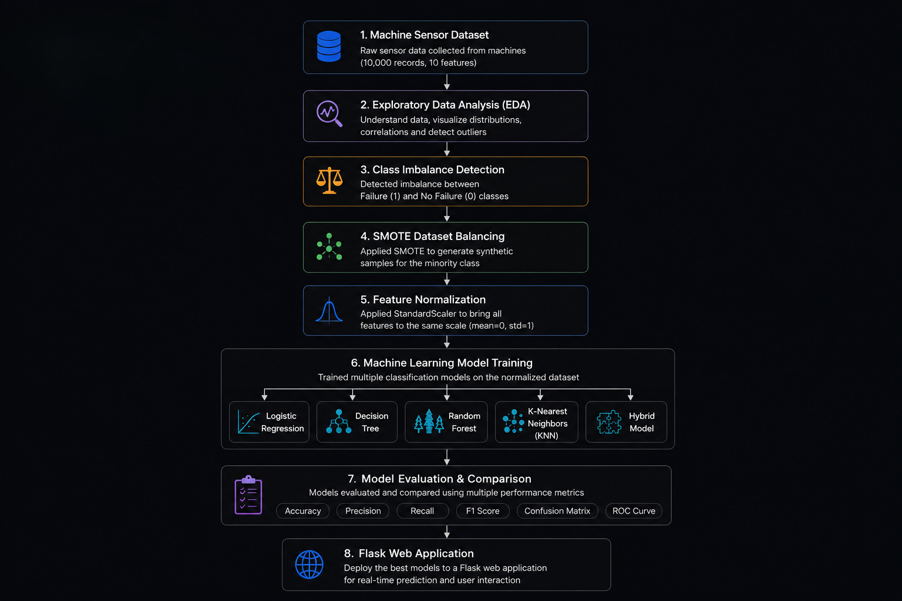

# Predictive Maintenance System Using Machine Learning

## Project Overview

This project focuses on **Predictive Maintenance using Machine Learning**.
The goal is to analyze machine sensor data and predict potential machine failures before they occur.

Predictive maintenance helps industries reduce downtime, improve operational efficiency, and minimize maintenance costs by identifying equipment issues early.

The project is divided into **two phases**:

* **Phase 1:** Data Analysis and Preprocessing
* **Phase 2:** Machine Learning Model Training and Hybrid Model Development

---

## 🛠 Tech Stack

- Python
- Flask
- Scikit-Learn
- Pandas
- NumPy
- Matplotlib
- Seaborn
- Imbalanced-Learn (SMOTE)

---

---

---

# 📊 Project Workflow

<p align="center">
  
</p>

The project follows a complete machine learning pipeline, beginning with raw sensor data preprocessing, followed by class balancing using SMOTE, feature normalization, model training, evaluation, and deployment through a Flask web application.

---

# Phase 1 – Data Analysis and Preprocessing

Phase 1 focuses on understanding the dataset and preparing it for machine learning.

This phase includes:

* Exploratory Data Analysis (EDA)
* Bias Detection
* Dataset Balancing using SMOTE
* Feature Normalization
* Final Dataset Preparation

---

# Dataset Information

The dataset used in this project is the **Predictive Maintenance Dataset**, which contains machine sensor data used to predict failures.

### Dataset Size

* **Total Records:** 10,000
* **Features:** 10 columns

### Important Features

| Feature                 | Description                           |
| ----------------------- | ------------------------------------- |
| Type                    | Machine type (L, M, H)                |
| Air Temperature [K]     | Temperature of surrounding air        |
| Process Temperature [K] | Internal machine process temperature  |
| Rotational Speed [rpm]  | Machine rotational speed              |
| Torque [Nm]             | Torque applied                        |
| Tool Wear [min]         | Tool usage time                       |
| Target                  | Failure (0 = No Failure, 1 = Failure) |

---

# Step 1 – Exploratory Data Analysis (EDA)

EDA was performed to understand the dataset and identify patterns.

### Analysis Performed

* Dataset shape and structure
* Data types of features
* Missing value detection
* Statistical summary
* Feature distributions
* Correlation analysis
* Outlier detection

### Observations

* The dataset contained **no missing values**.
* All numerical features showed reasonable distributions.
* Some features displayed outliers which are natural in machine operation data.

EDA graphs were generated using **Matplotlib and Seaborn**.

---

# Step 2 – Bias Detection

Class distribution analysis showed that the dataset was **highly imbalanced**.

### Class Distribution

| Class          | Count |
| -------------- | ----- |
| No Failure (0) | 9661  |
| Failure (1)    | 339   |

This means the dataset had:

* **96.6% Normal Machines**
* **3.4% Failure Cases**

### Problem

Machine learning models trained on such datasets tend to become **biased toward the majority class**, leading to poor failure prediction.

---

# Step 3 – Dataset Balancing Using SMOTE

To solve the imbalance problem, the **SMOTE (Synthetic Minority Oversampling Technique)** algorithm was applied.

### What SMOTE Does

SMOTE generates **synthetic samples of the minority class** instead of simply duplicating existing samples.

This improves model learning and prevents overfitting.

### Result After SMOTE

| Class      | Count |
| ---------- | ----- |
| No Failure | 9661  |
| Failure    | 9661  |

The dataset became **perfectly balanced**.

A new dataset was generated:

```
balanced_dataset.csv
```

---

# Step 4 – Balanced Dataset Analysis

EDA was performed again on the balanced dataset to verify the effectiveness of SMOTE.

The analysis confirmed:

* Equal class distribution
* Consistent feature distributions
* Valid synthetic samples

---

# Step 5 – Feature Normalization

The dataset features were normalized using **StandardScaler**.

### Why Normalization is Required

Machine learning algorithms perform better when features are on similar scales.

Without normalization:

* Features with larger numeric ranges dominate learning
* Distance-based algorithms perform poorly

### StandardScaler Transformation

StandardScaler transforms data so that:

* Mean = 0
* Standard Deviation = 1

This ensures that all features contribute equally during training.

The final dataset generated:

```
normalized_dataset.csv
```

---

# Final Dataset

The final dataset used for machine learning has the following characteristics:

* Balanced classes
* Normalized features
* No missing values
* No redundant columns

### Final Dataset Size

| Rows   | Columns |
| ------ | ------- |
| 19,322 | 7       |

This dataset is now **ready for machine learning model training**.

---

# Phase 2 – Machine Learning Model Development

Phase 2 focuses on training, evaluating, and comparing multiple machine learning models using the preprocessed dataset generated in Phase 1.

### Models Implemented

- Logistic Regression
- Decision Tree
- Random Forest
- K-Nearest Neighbors (KNN)
- Hybrid Model

Each model was trained using the normalized dataset and evaluated using multiple performance metrics.

### Evaluation Metrics

- Accuracy
- Precision
- Recall
- F1 Score
- Confusion Matrix
- ROC Curve

Evaluation reports, comparison graphs, and performance metrics are available in the `phase2_models/outputs/` directory.

---

# Hybrid Model

A hybrid model was developed by combining the strengths of multiple machine learning algorithms to improve predictive performance.

The hybrid approach was evaluated alongside the individual models to compare classification performance and overall reliability.

---

# Tech Stack

| Technology | Purpose |
|------------|---------|
| Python | Programming Language |
| Flask | Web Application |
| Pandas | Data Processing |
| NumPy | Numerical Computing |
| Matplotlib | Data Visualization |
| Seaborn | Statistical Visualization |
| Scikit-Learn | Machine Learning Models |
| Imbalanced-Learn | SMOTE Dataset Balancing |

---

# Project Workflow

```text
Machine Sensor Dataset
        │
        ▼
Exploratory Data Analysis (EDA)
        │
        ▼
Class Imbalance Detection
        │
        ▼
SMOTE Dataset Balancing
        │
        ▼
Feature Normalization
        │
        ▼
Machine Learning Model Training
        │
        ▼
Model Evaluation & Comparison
        │
        ▼
Hybrid Model Development
        │
        ▼
Flask Web Application
```

---

# Project Structure

```text
Predictive-Maintenance-ML/
│
├── data_processing/
│   ├── predictive_maintenance.csv
│   ├── balanced_dataset.csv
│   ├── normalized_dataset.csv
│   └── preprocessing scripts
│
├── eda_graphs/
├── balanced_eda_graphs/
├── normalized_eda_graphs/
├── smote_comparison_graphs/
│
├── phase2_models/
│   ├── models/
│   ├── evaluation/
│   ├── outputs/
│   └── saved_models/
│
├── predictive_maintenance_site/
│
├── requirements.txt
├── Procfile
├── runtime.txt
└── README.md
```

---

# Results

The project successfully demonstrates an end-to-end predictive maintenance pipeline, including:

- Exploratory Data Analysis (EDA)
- Dataset Balancing using SMOTE
- Feature Normalization
- Training Multiple Machine Learning Models
- Model Evaluation and Performance Comparison
- Hybrid Model Development
- Deployment through a Flask Web Application

---

# Conclusion

This project demonstrates a complete machine learning pipeline for predictive maintenance, starting from raw sensor data and progressing through preprocessing, model training, evaluation, and deployment.

The implemented workflow provides an effective framework for predicting machine failures, helping reduce downtime and support proactive maintenance in industrial environments.